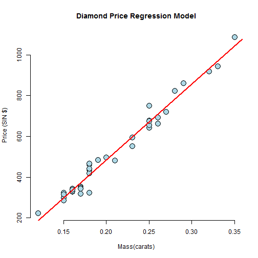

## Diamond Price Estimator Tool

Introduction and Use Cases

--- .class #id1

## Introduction

This tool has been developed to easily estimate diamond's price based on its mass. The data used to create the predictor is publicly available at http://www.amstat.org/publications/jse/datasets/diamond.txt. This data set was created and contributed by Singfat Chu.

--- .class #id2

## The R Code: server.R


```r
library(shiny);library(UsingR);data(diamond)
shinyServer(
        function(input, output) {
         
                output$main_plot <- renderPlot({      
                        plot(diamond$carat, diamond$price,
                             xlab = "Mass(carats)",
                             ylab = "Price (SIN $)",
                             bg = "lightblue",
                             main = "Diamond Price Regression Model",
                             col = "black", cex = 2, pch = 21, frame = FALSE)
                        if (input$draw_trend) {
                                abline(lm(price~carat, data = diamond), lwd = 2, col = "red")
                        }        
                })     
                output$calculated_price <- renderText({
                        if (input$calc_Button == 0)
                                return()
                        isolate(fit <- lm(price~carat, data=diamond))
                        isolate(coef(fit)[1] + coef(fit)[2] * as.numeric(input$calculate_price))                       
                })
        })
```

--- .class #id3

## The R Code: ui.R


```r
library(shiny)
shinyUI(bootstrapPage(
        h3("Diamond Price Estimator Tool"),       
        textInput(inputId = "calculate_price",
                      label = strong("Calculate Diamond Price - Enter carats"),
                      value = 1),
        actionButton("calc_Button", "Calculate"),
        p('Diamond Estimated Price (SIN $):'),
        textOutput('calculated_price'),
        
        checkboxInput(inputId = "draw_trend",
                      label = strong("Draw Trend Line"),
                      value = FALSE),      
        plotOutput(outputId = "main_plot", height = "500px", width = "500px")       
))
```

--- .class #id4

## Let's Test it!

 

For more information, please use the documentation link in http://patricio-villar.shinyapps.io/course_project


